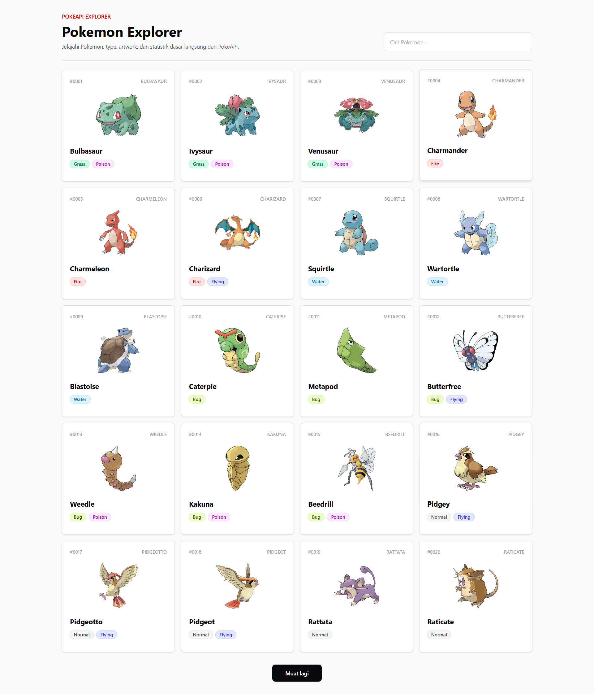
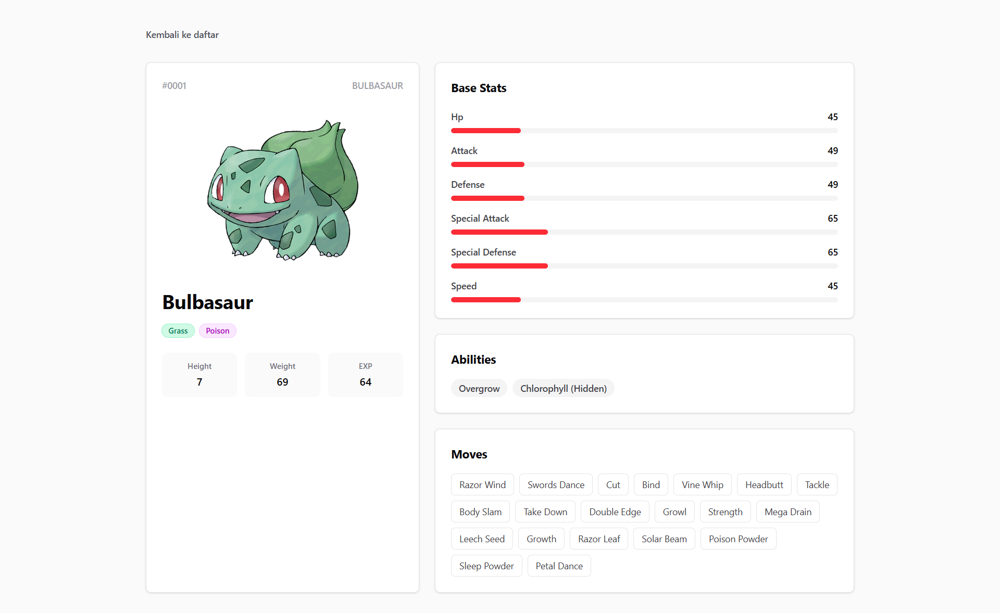

# Pokemon Explorer

Pokemon Explorer adalah aplikasi MVP berbasis Laravel dan Livewire untuk menjelajahi data Pokemon dari PokeAPI. Aplikasi ini menampilkan daftar Pokemon, pencarian nama, load more tanpa reload penuh, dan halaman detail berisi artwork, type, abilities, stats, ukuran, base experience, serta moves.

## Tech Stack

- Laravel 13 untuk backend, routing, service container, Blade, cache, dan HTTP client.
- Livewire 4 untuk komponen halaman utama dan detail Pokemon.
- Blade Components untuk UI yang dipakai ulang, seperti card, type badge, empty state, error state, skeleton, dan stat bar.
- Tailwind CSS 4 untuk styling responsif.
- Vite untuk asset bundling.
- Pest/PHPUnit untuk test suite.
- Mockery untuk mocking service pada feature tests.

## API yang Digunakan

Aplikasi mengambil data dari [PokeAPI](https://pokeapi.co/).

Default base URL:

```env
POKEAPI_BASE_URL=https://pokeapi.co/api/v2
```

Semua akses ke PokeAPI dipusatkan di:

```text
app/Services/PokeApiService.php
```

Service ini bertanggung jawab untuk:

- mengambil daftar Pokemon dengan pagination;
- mengambil detail Pokemon berdasarkan nama atau ID;
- mencari Pokemon berdasarkan nama;
- normalisasi payload PokeAPI agar mudah dipakai di Blade;
- caching response dengan Laravel Cache;
- fallback aman ketika detail Pokemon tidak ditemukan.

## Fitur Utama

- Halaman daftar Pokemon di `/`.
- Kartu Pokemon berisi nomor, nama, artwork, dan type.
- Search Pokemon tanpa request POST Livewire, menggunakan endpoint GET agar aman pada environment PHP yang bermasalah dengan temp POST buffering.
- Tombol `Muat lagi` menampilkan `Mohon tunggu`, mengambil data berikutnya via GET, lalu append kartu baru tanpa scroll balik ke atas.
- Halaman detail Pokemon di `/pokemon/{name}`.
- Error state dan empty state yang ramah.
- UI responsif untuk mobile, tablet, dan desktop.

## Route Penting

```text
GET /                     Halaman daftar Pokemon
GET /pokemon/search       Endpoint JSON untuk search
GET /pokemon/load-more    Endpoint JSON untuk load more
GET /pokemon/{name}       Halaman detail Pokemon
```

## Setup

```bash
composer install
npm install
cp .env.example .env
php artisan key:generate
npm run build
php artisan serve
```

Buka:

```text
http://127.0.0.1:8000
```

Catatan: dependency yang terpasang dapat membutuhkan versi PHP yang lebih baru daripada PHP bawaan XAMPP lama. Jika `php artisan` gagal karena versi PHP, gunakan PHP yang sesuai dengan `composer.lock`.

## Konfigurasi Environment

Pastikan `.env` berisi konfigurasi file-backed untuk MVP tanpa database persistence Pokemon:

```env
SESSION_DRIVER=file
CACHE_STORE=file
QUEUE_CONNECTION=sync
POKEAPI_BASE_URL=https://pokeapi.co/api/v2
```

Project juga menyediakan `public/.user.ini` dan `storage/framework/tmp` untuk membantu environment lokal yang tidak dapat menulis ke temp directory default PHP.

## Testing dan Quality Gates

Jalankan test:

```bash
php artisan test
```

Jalankan formatter:

```bash
vendor/bin/pint
```

Build asset:

```bash
npm run build
```

## Struktur Utama

```text
app/Livewire/PokemonList.php
app/Livewire/PokemonDetail.php
app/Services/PokeApiService.php
resources/views/livewire/pokemon-list.blade.php
resources/views/livewire/pokemon-detail.blade.php
resources/views/components/pokemon/
tests/Feature/
```

## Preview

### Homepage



### Detail


